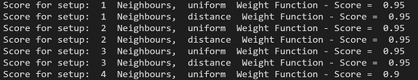
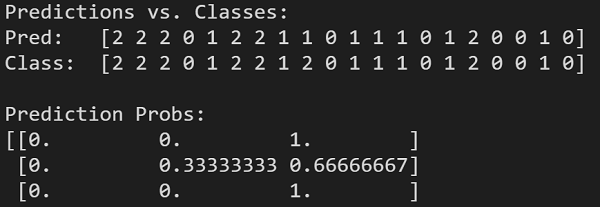

# Exercise

Hallo Leute!

Willkommen bei der nächsten Programmier-Übung in diesem Kurs.

## Vorwort

In dieser Aufgabe wird das Iris Dataset und der K-Nearest Neighbor Classifier verwendet.

### Aufgabe 1

Das Ziel dieser Programmierübung ist es, einen Score von über 95% zu erreichen.Verwendet dazu den Code aus dem letzten Video. Diesen Code könnt ihr dann erweitern, um folgendeParametern/Einstellungen auszutesten:

- Welche der Features betrachten?
- Mehr als 2 Features verwenden (die Plotting Funktion, dann bitte nicht ausführen)
- Anzahl an Neighbors K und Weights

#### Beispiel

### Aufgabe 2

Wählt dann das beste Modell aus und trainiert es erneut auf dem Datensatz.Gebt euch dann die Predictions (knn.predict) und die Predictions-Probabilities (knn.predict_proba) vom Test-Set aus.

#### Beispiel

Viel Erfolg bei der Aufgabe!
